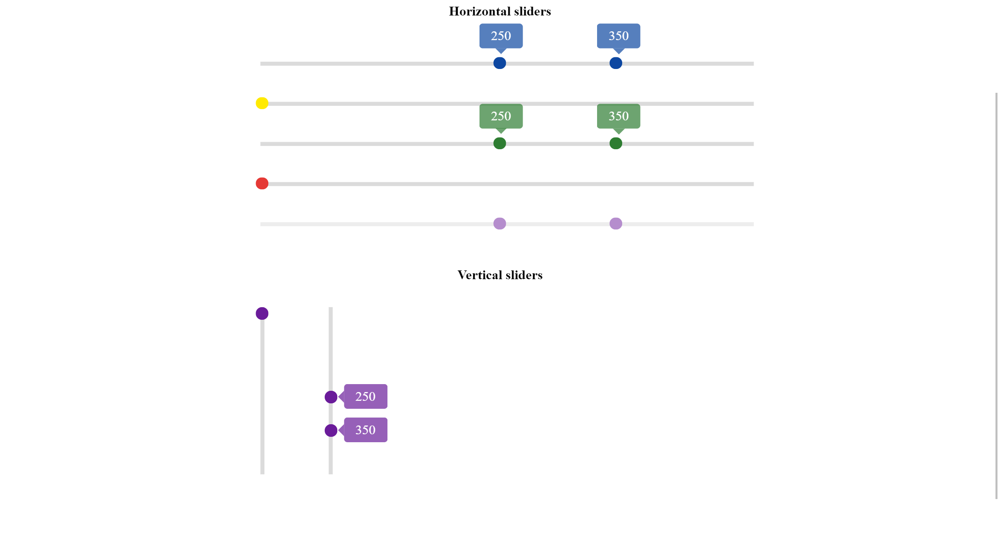

# Ngx Slider Moby.
Reactive slider/scope slider component for angular.

Live demo: https://pavelpleshko-slider-moby.now.sh

#### Screenshot


## Get started

### Slider supports touch events for mobile devices. To enable it first install `hammerjs`:
`npm install hammerjs --save`

### Install package itself
`npm install ngx-slider-moby --save`

## How to use

### Include `NgxSliderMobyModule` into your module like so:
```
import { NgxSliderMobyModule } from 'ngx-slider-moby/slider';
...
@NgModule({
  imports: [
    NgxSliderMobyModule
  ],
})
export class YourModule { }
```

### In your component do not forget to import `hammerjs` to enable touch events, like so:
```
...
import 'hammerjs';
...your code 
```

### Inclusion of module will give you access to the slider component which you can include in your components. Example:
```
<ngx-slider-moby [max_value]="300" [min_value]="0" [range]="true"></ngx-slider-moby>
```

### Can be used as form control(implements ControlValueAccessor interface) like so:
```
<div [formGroup]="myForm">
<ngx-slider-moby [max_value]="300" [min_value]="0" [range]="true" formControlName="priceRange"></ngx-slider-moby>
<ngx-slider-moby [max_value]="10" [min_value]="0" [range]="false" formControlName="kilogramms"></ngx-slider-moby>
</div>
``` 

#### NOTE: In case when you are using `[range]="true"` form control value will be as follows:
`{from:20,to:55}`

## Inputs


| Prop | Type | Default | Description |
| --- | --- | --- | --- |
| `min_value` | number | `0` | minimal value for given slider |
| `max_value` | number | `500` | maximal value for given slider |
| `value_from` | number | `0` | If specified will assign provided value to the component value1 variable|
| `value_to` | number | `0` | Similar with above but for value2 variable |
| `showThumbLabels` | boolean | `true` | whether or not to show labels on default slider(not range) |
| `vertical` | boolean | `true` | If `false` then the slider will appear horizontally |
| `step` | number | `1` | Allows to specify the number of units that one step has |
| `range` | boolean | `false` | If speified `true` then the slider will be a scope slider and have corresponding value and appearance(ex.: from 30 to 50). Thumblabels are visible by default in this type of slider |
| `disabled` | boolean | `false` |  If `true` then puts slider in a disabled state and doesn't handle any events on the element |
| `direction` | 'ltr' or 'rtl' | `ltr` | Left to right or right to left(not implemeneted yet) |
|`color` | string | `purple` | Slider will assume the corresponding color palette. Options: red,green,blue,purple,yellow | 
## Events 
#### `valueChange` - emits the object which looks like this in case of default slider `{sliderId:string,value:number,percent:number}`,in case of range slider as follows:
`{sliderId:string,
	value:
	{from:number,to:number},
	percent:
	{from:number,to:number}
}`

#### `blurred` - blur event emits boolean `true` or `false`;

#### `focused` - focus event emits boolean `true` or `false`;

### Update 1.1.0 info.
1. Added colors 'black','grey'.
2. Added support of floating `step`.
3. Fixed some bugs.

